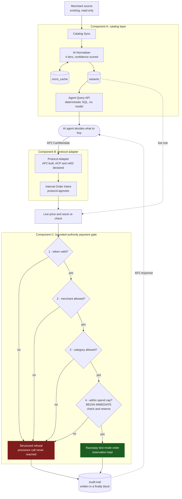

# Agentic Commerce Infrastructure

Making a merchant transactable by an AI buyer, end to end, with zero backend changes.

Razorpay AI Buildathon, Track 1: AI Growth & Agentic Commerce.

---

## How we solve the problem

An AI agent that wants to buy from a merchant hits three walls. Each component below
removes one, and they chain into a single path. The merchant changes no database, no
checkout and no backend; they add one line to a page they already serve.

### Wall 1: agents cannot read merchant catalogs

Product pages are built for human eyes. A merchant's own feed says `Kurti - Ladies`,
`Navy Blu`, `cottn`, `ethnic wear top`.

**Component A, the catalog layer** normalises that into a canonical, versioned
taxonomy and exposes it at a well-known path. Every value carries a confidence score,
and the taxonomy is hierarchical rather than flat: `Navy Blu` becomes family `blue`
with shade `navy`, so an agent can ask for blue and get navy, or ask for navy
specifically. Discovery is one link tag in the merchant's existing page head.

Normalisation runs in four tiers, cheapest first, each seeing only what the tier above
could not answer:

| tier | cost | when |
|---|---|---|
| `norm_cache` | free | already normalised in a previous sync |
| exact synonym | free | the raw string is a known spelling |
| Gemini | free tier | batched, one request per ~25 unknown strings |
| `difflib` | free | Gemini has no quota, no key, or no network |

The Gemini free tier allows 20 requests per key per model per day. A full catalog sync
costs 3. The cache is what keeps a re-sync at zero, and a weak `difflib` guess is
deliberately not cached, because caching it would make a temporary outage permanent.

The query path itself contains no model. An agent asking for `category=kurta&
max_price=1500` gets the same rows every time and can be held to that.

### Wall 2: agents speak different protocols

AP2, ACP and x402 all express "I want to buy this" differently, and no merchant is
going to integrate each one.

**Component B, the protocol adapter** translates any supported dialect into one
internal Order Intent, and translates the merchant's answer back. AP2 is built in both
directions; ACP and x402 are declared in the dispatch table and raise a clear error.
Adding one is a function and a dict entry, and nothing downstream of the internal
format learns that it happened.

A refusal is returned as a structured protocol decline, never as a transport error. An
agent that cannot tell "your cap is spent" from "the server broke" will retry the
first one, which is exactly what a spend cap exists to stop.

### Wall 3: an agent that can pay can overspend

**Component C, the bounded-authority payment gate.** Before transacting, an agent
holds a scoped token issued by the user: a spend cap, a merchant allowlist, a category
allowlist and an expiry. The gate checks all four, in that order, and any failure
blocks with no partial charge and no silent override.

Three properties it is built to guarantee:

- **A blocked attempt cannot charge.** Not "does not", cannot. Every refusal returns
  before control reaches the processor call, so no ordering bug or future edit to the
  happy path can produce a charge on a refused intent.
- **Two concurrent intents cannot both fit one cap.** The cap check and the reservation
  happen inside one `BEGIN IMMEDIATE` transaction. Checking the cap and incrementing
  afterwards is the classic double-spend.
- **Every attempt is audited, including the ones that crash.** The audit write is in a
  `finally`. A trail recording only the paths that went well proves nothing about
  whether anyone was protected.

Money is integer paise end to end. Floats do not belong in a spend cap, and a cap wrong
by a rounding error is not a cap.

---

## Architecture



### Design decisions

**The store is flat, the API is nested.** One row per SKU with canonical attributes as
columns. SQLite indexes columns, not JSON paths, and every catalog filter is a column
comparison. The nested product shape is reassembled on read.

**The live re-check runs before the gate sees an amount.** The catalog can be a sync
interval stale and the agent's declared price is its own claim. Neither is trusted as
the number to charge; a stale price is how a spend cap gets quietly exceeded.

**Reserve before charging, release on failure.** The reservation is taken before the
processor call and released if it fails. The reverse order leaves a window where a
second intent reads a stale balance, and a charge that never happened must not consume
the user's remaining authority.

**Protocol stubs raise rather than return `None`.** A stub returning `None` would let
an unsupported protocol reach the payment gate carrying half a message, which is what
the adapter exists to prevent.

**Sync is an endpoint, not a cron.** A merchant webhook calls the same endpoint a
scheduler would.

### Layout

```
agentic_commerce/
  db.py              SQLite schema. Four tables, no ORM. Money in integer paise.
  taxonomy.py        Canonical taxonomy, hierarchical: colour family plus shade.
  mock_merchant.py   A merchant whose feed is as messy as a real one.
  llm.py             Gemini on the free tier: key rotation, quota fallback.
  normalize.py       The four-tier normaliser and the confidence bands.
  catalog.py         Sync, the query API, the live price re-check.       [A]
  protocols.py       AP2 both ways; ACP and x402 declared, not built.    [B]
  payment.py         The gate, the processor call, the audit writer.     [C]
  app.py             The HTTP surface.

demo.py              The end-to-end run, including the blocked purchase.
bench.py             The normalisation benchmark.
verify_razorpay.py   Asks Razorpay whether the blocked attempts charged.
tests/test_gate.py   The gate's self-check.
reports/             Benchmark and audit output.
```

### Scope

Built: the catalog layer, the AP2 translator, the payment gate, the audit trail.

Not built, deliberately: ACP and x402 translators; cryptographic verification of AP2
mandate signatures; payment capture, since that needs the customer-facing Checkout
handshake an autonomous agent does not perform, so the gate creates an authorised
test-mode order and the audit records exactly that; a merchant registry, since the
link tag solves catalog access once a merchant is known, not which merchant an agent
should go to.

---

## How to run

Requires Python 3.11+, a Gemini API key, and optionally Razorpay test-mode keys.

```bash
uv sync                 # or: pip install -e .
```

Create a `.env`:

```
GOOGLE_API_KEY_1=your_gemini_key
RAZORPAY_KEY_ID=rzp_test_xxxxxxxx
RAZORPAY_KEY_SECRET=your_secret
```

Without Razorpay keys everything still runs: the gate performs every check and writes
a complete audit trail, and only the processor call is stubbed.

### The demo

```bash
python demo.py
```

Discovers the merchant, syncs and normalises the catalog, queries it, then makes three
purchases against a token capped at INR 1500 for kurtas and dupattas at one merchant:
one allowed, one refused for exceeding the cap, one refused for a category the user
never authorised. Prints the audit trail at the end.

### Verifying it works

```bash
python tests/test_gate.py     # the gate's guarantees
python verify_razorpay.py     # asks Razorpay whether blocked attempts charged
python bench.py               # normalisation accuracy, 138 labelled cases
python bench.py --offline     # the same with the LLM tier disabled
```

`tests/test_gate.py` asserts that each refusal reason fires on the right input, that a
blocked attempt reaches the processor zero times, that every attempt writes exactly one
audit row including the ones that crash, that a failed processor call releases its
reservation, and that two concurrent intents cannot both fit inside one cap.

`verify_razorpay.py` does not trust this repository's own audit log. It runs the demo
and then asks Razorpay directly: every allowed attempt must have a real order for the
exact amount, every blocked attempt must have produced none, and nothing may be
captured. When Razorpay's list endpoint is too stale to rule out extra orders it
reports that check as inconclusive rather than passing on an empty result.

### The server

```bash
uvicorn agentic_commerce.app:app --reload
```

Then open `/docs` for the full API, or:

```bash
curl -X POST 127.0.0.1:8000/sync
curl "127.0.0.1:8000/.well-known/agent-catalog.json?category=kurta&max_price=1500"
curl 127.0.0.1:8000/tokens/tok_demo_001
curl 127.0.0.1:8000/audit
```
